# Manuel d'utilisation - L'Accordeur

**Plateforme de gestion du Pole Associatif de Guyane**

**Version : 1.0 - Septembre 2026**

**URL du site : https://laccordeur973.fr**

---

## Table des matieres

1. [Introduction](#1-introduction)
2. [Acces a la plateforme](#2-acces-a-la-plateforme)
3. [Tableau de bord](#3-tableau-de-bord)
4. [Pointage et Acces visiteurs](#4-pointage-et-acces-visiteurs)
5. [Gestion des contacts](#5-gestion-des-contacts)
6. [Reservation de salles (parcours client)](#6-reservation-de-salles-parcours-client)
7. [Administration des reservations](#7-administration-des-reservations)
8. [Gestion des salles](#8-gestion-des-salles)
9. [Creneaux horaires](#9-creneaux-horaires)
10. [Grille tarifaire](#10-grille-tarifaire)
11. [Options de reservation](#11-options-de-reservation)
12. [Ecosysteme et partenaires](#12-ecosysteme-et-partenaires)
13. [Gestion des utilisateurs](#13-gestion-des-utilisateurs)

---

## 1. Introduction

L'Accordeur est une plateforme de gestion pour le Pole Associatif de Guyane, un espace de 1 600 m2 situe a Cayenne. La plateforme permet de :

- **Gerer le pointage** des visiteurs et residents via WeezAccess (Weezevent)
- **Reserver des salles** en ligne avec paiement Stripe
- **Gerer les contacts** et l'historique des visites
- **Administrer les espaces**, creneaux, tarifs et options
- **Presenter l'ecosysteme** des associations residentes

### Site public

Le site public est accessible a tous sur **https://laccordeur973.fr**. Il comprend :
- La page d'accueil presentant L'Accordeur
- La page des espaces disponibles
- Le planning des reservations
- Le formulaire de reservation en ligne
- La page ecosysteme (associations residentes)
- Le formulaire de contact
- Le formulaire de Pass Visiteur

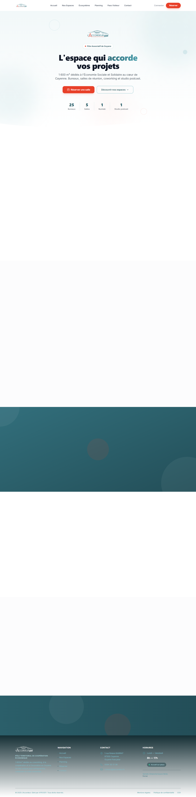

---

## 2. Acces a la plateforme

### Se connecter

1. Rendez-vous sur **https://laccordeur973.fr/login**
2. Saisissez votre **email** et votre **mot de passe**
3. Cliquez sur **Se connecter**

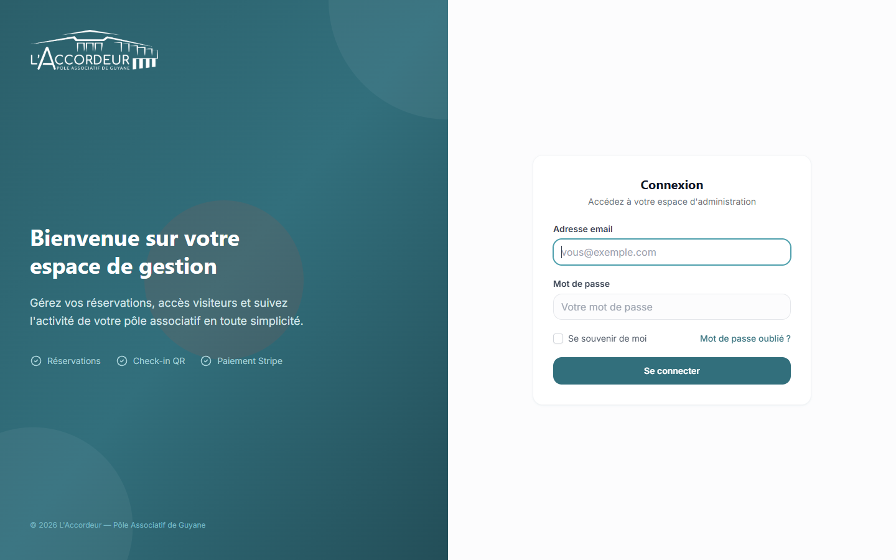

### Roles utilisateurs

Il existe 3 roles avec des permissions differentes :

| Role | Acces |
|------|-------|
| **Admin** | Acces complet : salles, tarifs, utilisateurs, reservations, pointage, ecosysteme |
| **Manager** | Gestion des reservations, pointage, contacts, salles |
| **Accueil** | Pointage, contacts, consultation des reservations |

---

## 3. Tableau de bord

Apres connexion, vous arrivez sur le **tableau de bord** qui affiche en un coup d'oeil :

- **Nombre de personnes presentes** actuellement dans le batiment
- **Entrees du jour** (nombre de pointages d'entree)
- **Nombre total de contacts** enregistres
- **Derniers pointages** avec le statut (present, sorti, en attente)

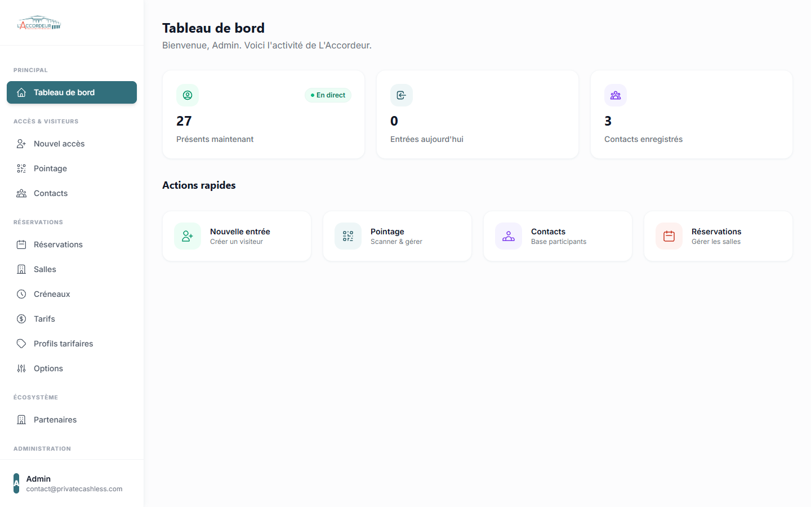

Depuis le tableau de bord, vous pouvez acceder rapidement a toutes les fonctionnalites via le **menu lateral gauche**.

---

## 4. Pointage et Acces visiteurs

### 4.1 Comment fonctionne le pointage

Le pointage fonctionne avec **WeezAccess** (application Weezevent) sur un terminal a l'entree du batiment :

1. Le visiteur ou resident presente son **QR code / code-barres Weezevent**
2. Le terminal WeezAccess scanne le code
3. La synchronisation automatique (chaque minute) remonte le scan dans la plateforme
4. Le **premier scan du jour** enregistre l'**entree**
5. Chaque **scan suivant** met a jour l'heure de **sortie**
6. A **19h00**, les pointages sans sortie sont fermes automatiquement

### 4.2 Page de pointage

La page **Pointage** (`/admin/checkins`) affiche :

- Les **statistiques** : total passes, presents, en attente, sortis
- Un **formulaire de scan manuel** pour saisir un code directement
- Le **tableau des pointages** avec date, visiteur, motif, code, entree, sortie et statut

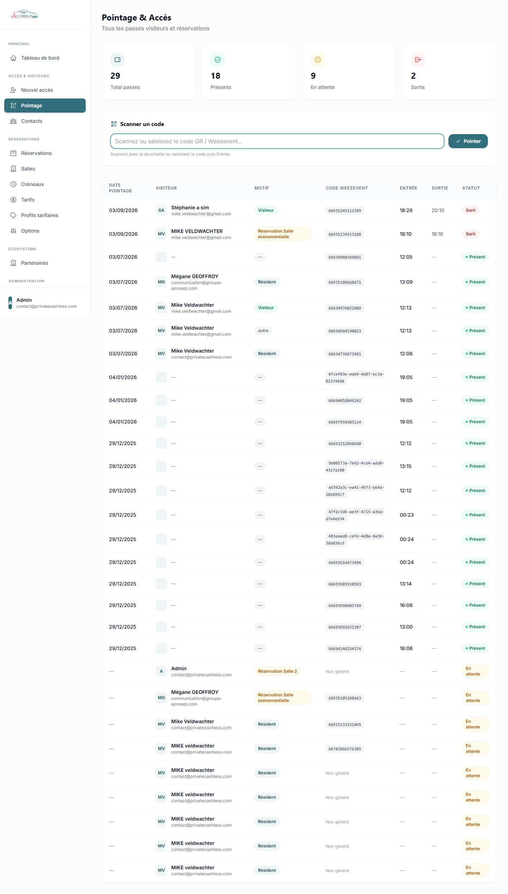

### 4.3 Scanner un code manuellement

Si le terminal WeezAccess n'est pas disponible, vous pouvez scanner manuellement :

1. Allez sur **Pointage** dans le menu
2. Dans le champ **"Scannez ou saisissez le code QR / Weezevent..."**, tapez ou scannez le code
3. Appuyez sur **Entree** ou cliquez sur **Pointer**
4. Un message de confirmation s'affiche (vert = succes, rouge = erreur)

> **Avec une douchette USB** : branchez la douchette, scannez le code-barres. Le formulaire se soumet automatiquement apres la saisie.

### 4.4 Creer un Pass Visiteur

Pour creer un pass pour un visiteur ponctuel :

1. Allez sur **Nouvel acces** dans le menu (ou `https://laccordeur973.fr/acces`)
2. Remplissez le formulaire : prenom, nom, email, motif de visite
3. Cliquez sur **Enregistrer**
4. Un QR code est genere et envoye par email au visiteur
5. Le visiteur peut presenter ce QR code au terminal WeezAccess

### 4.5 Statuts de pointage

| Statut | Signification |
|--------|--------------|
| **En attente** | Le pass est cree mais aucun scan n'a ete effectue |
| **Present** | Le visiteur est entre (scan d'entree enregistre, pas encore de sortie) |
| **Sorti** | Le visiteur est sorti (scan de sortie enregistre) |

### 4.6 Modifier un visiteur

Pour modifier les informations d'un visiteur, cliquez sur son code Weezevent dans le tableau pour acceder a la page d'edition.

---

## 5. Gestion des contacts

### 5.1 Liste des contacts

La page **Contacts** (`/admin/contacts`) affiche tous les contacts enregistres avec :

- Nom et prenom
- Email
- Nombre de visites
- Dernier QR code genere

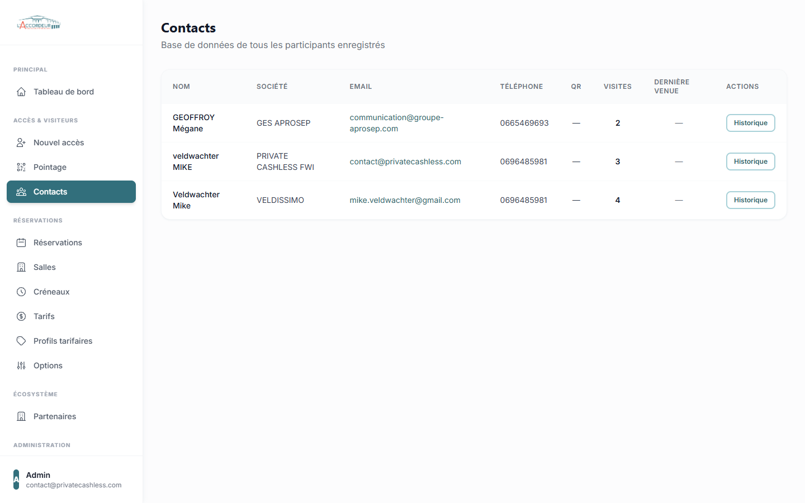

### 5.2 Detail d'un contact

Cliquez sur un contact pour voir :

- Ses informations completes (nom, email, telephone, societe)
- L'historique de toutes ses visites avec dates et heures

---

## 6. Reservation de salles (parcours client)

### 6.1 Vue d'ensemble

Le parcours de reservation est accessible au public sur **https://laccordeur973.fr/reservation**. Les visiteurs peuvent reserver une salle en 3 etapes : **Date > Creneau > Reserver**.

### 6.2 Etape 1 : Choisir une salle

Sur la page `/reservation`, le client voit la liste des salles disponibles avec :
- Photo de la salle
- Capacite et surface
- Equipements disponibles
- Fourchette de prix

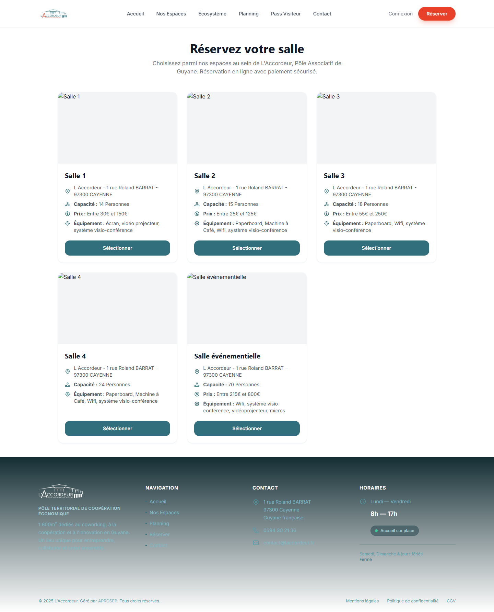

Le client clique sur **Reserver cette salle** pour commencer.

### 6.3 Etape 2 : Choisir une date et un creneau

Sur la page de reservation de la salle :

1. **Selectionnez une date** dans le calendrier interactif
   - Les points verts indiquent les creneaux disponibles
   - Les points rouges indiquent les creneaux deja reserves
   - Les dates passees sont grisees

2. **Choisissez un creneau horaire** parmi ceux disponibles
   - Les creneaux affiches montrent les horaires et le statut (Disponible / Reserve)

3. **Selectionnez votre profil tarifaire** (Abonne, Adherent, Non-adherent, Resident, etc.)
   - Le prix s'affiche automatiquement

4. **Ajoutez des options** si disponibles (petit dejeuner, repas, etc.)
   - Chaque option a un prix unitaire et un compteur de quantite
   - Le prix total se met a jour en temps reel

### 6.4 Etape 3 : Coordonnees et paiement

1. Remplissez vos **coordonnees** : nom, email, telephone
2. Cliquez sur **Reserver & Payer**
3. Vous etes redirige vers la **page de paiement Stripe** (securise)
4. Apres paiement, vous recevez un **email de confirmation**

### 6.5 Le planning public

Le **planning** (`/planning`) affiche un calendrier interactif montrant les reservations de toutes les salles. Les visiteurs peuvent voir les disponibilites avant de reserver.

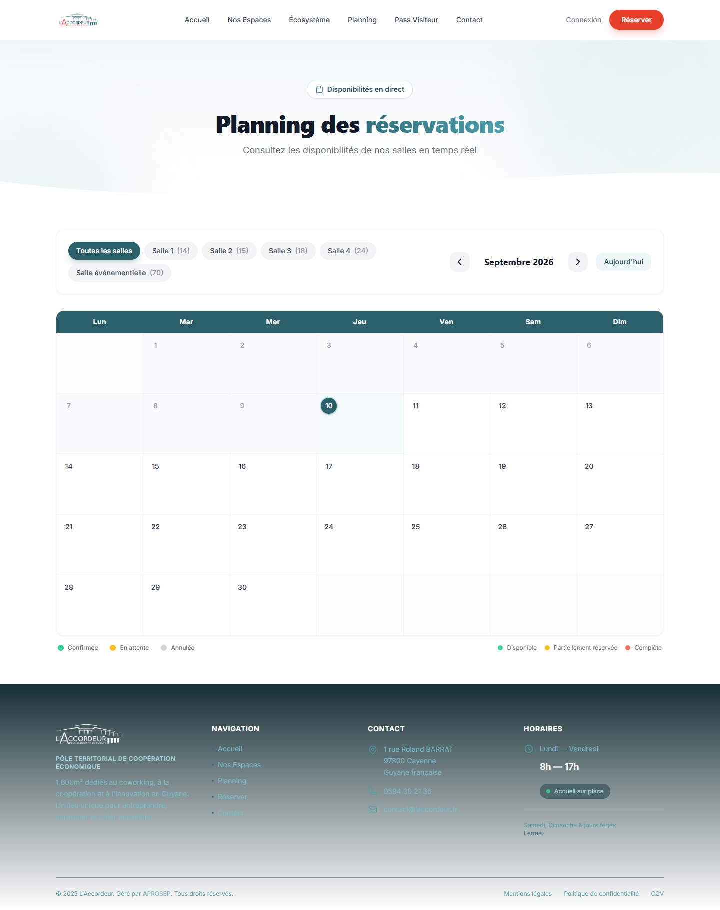

---

## 7. Administration des reservations

### 7.1 Liste des reservations

La page **Reservations** (`/admin/reservations`) affiche toutes les reservations avec :

- Client (nom, email, telephone)
- Salle reservee
- Date et creneau
- Prix
- Statut (en attente, paye, annule)

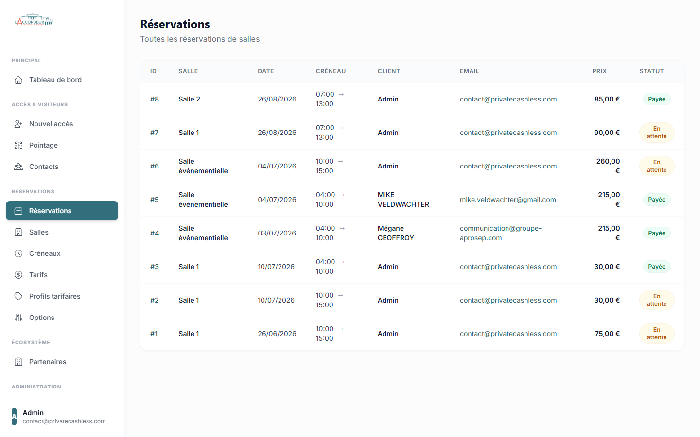

### 7.2 Detail d'une reservation

Cliquez sur une reservation pour voir le detail complet et les actions disponibles :

- **Renvoyer l'email** de confirmation au client
- **Annuler et rembourser** la reservation (le remboursement Stripe est automatique)

---

## 8. Gestion des salles

### 8.1 Liste des salles

La page **Salles** (`/admin/rooms`) affiche toutes les salles sous forme de cartes avec :

- Photo de la salle
- Nom et description
- Capacite et equipements
- Statut (active / inactive)

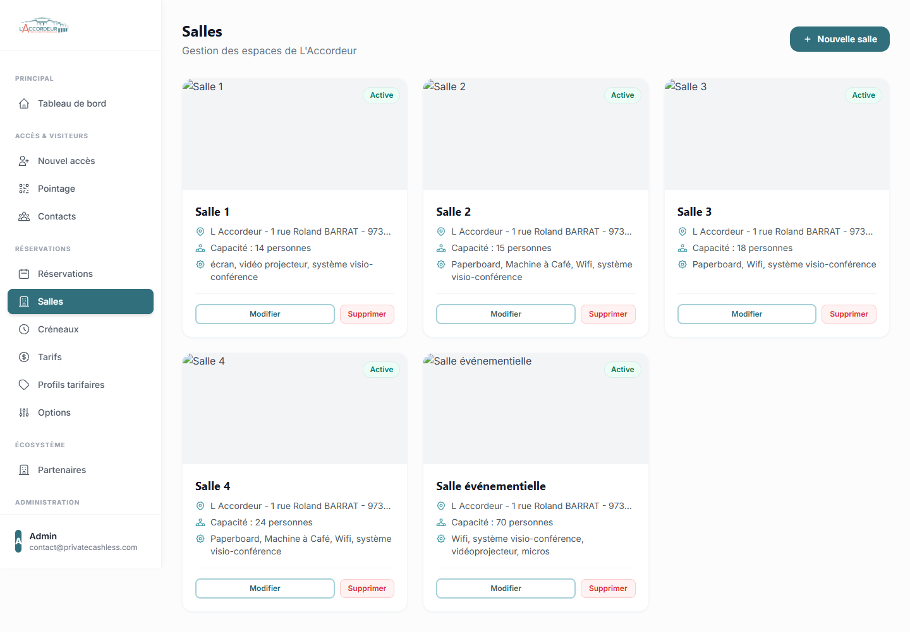

### 8.2 Creer une salle

1. Cliquez sur **Nouvelle salle**
2. Remplissez les informations :
   - **Nom** de la salle (obligatoire)
   - **Description** (optionnel)
   - **Photo** de la salle (optionnel, max 2 Mo)
   - **Capacite** en nombre de personnes (obligatoire)
   - **Surface** en m2 (optionnel)
   - **Adresse** (optionnel)
   - **Equipements** separes par des virgules (ex: Videoprojecteur, Wi-Fi, Tableau blanc)
   - **Active** : cochez pour rendre la salle disponible a la reservation
3. Cliquez sur **Creer la salle**

### 8.3 Modifier ou supprimer une salle

- Cliquez sur **Modifier** pour editer les informations
- Cliquez sur **Supprimer** pour retirer la salle (attention : irreversible)

---

## 9. Creneaux horaires

### 9.1 Configurer les creneaux

Les creneaux horaires definissent les plages de reservation disponibles. Par exemple :

| Creneau | Horaires |
|---------|----------|
| Matin | 07h00 - 13h00 |
| Apres-midi | 13h00 - 19h00 |
| Journee | 07h00 - 19h00 |

### 9.2 Ajouter un creneau

1. Allez dans **Creneaux** (`/admin/time-slots`)
2. Cliquez sur **Nouveau creneau**
3. Remplissez : code, libelle, heure de debut, heure de fin, ordre d'affichage
4. Cochez **Actif** pour le rendre visible
5. Cliquez sur **Creer**

---

## 10. Grille tarifaire

### 10.1 Profils tarifaires

Les profils tarifaires definissent les types de clients. Par defaut :

- **Abonne** : client avec abonnement
- **Adherent** : membre adherent
- **Non-adherent** : client occasionnel

Vous pouvez ajouter de nouveaux profils (ex: Resident, Partenaire) depuis **Profils tarifaires** (`/admin/pricing-profiles`).

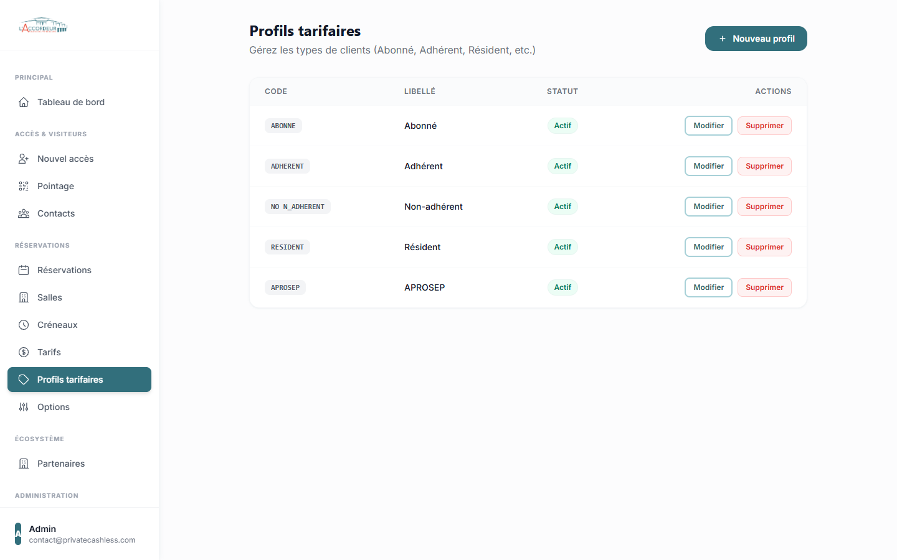

### 10.2 Ajouter un profil tarifaire

1. Cliquez sur **Nouveau profil**
2. Saisissez un **libelle** (ex: Resident) et un **code** unique (ex: RESIDENT)
3. Cochez **Actif** pour le rendre visible lors de la reservation
4. Cliquez sur **Creer le profil**

### 10.3 Matrice des tarifs

La page **Tarifs** (`/admin/rates`) permet de definir les prix pour chaque combinaison **salle x creneau x profil**.

Pour chaque salle, un tableau affiche :
- En lignes : les creneaux horaires
- En colonnes : les profils tarifaires
- Dans chaque cellule : le prix en EUR

1. Saisissez les prix dans les champs
2. Cliquez sur **Enregistrer les tarifs**

> **Important** : si un prix n'est pas defini pour une combinaison, le client ne pourra pas reserver cette combinaison.

---

## 11. Options de reservation

Les options sont des extras que le client peut ajouter a sa reservation (petit dejeuner, repas, etc.).

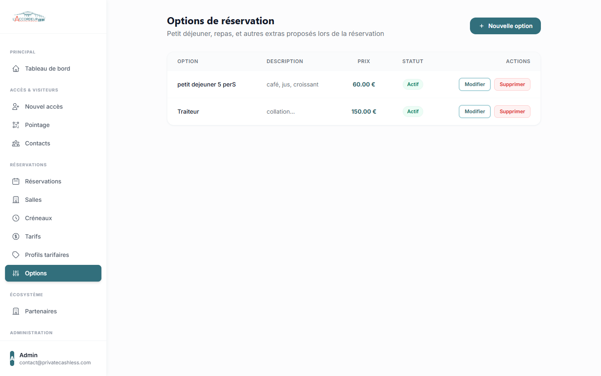

### 11.1 Ajouter une option

1. Allez dans **Options** (`/admin/options`)
2. Cliquez sur **Nouvelle option**
3. Remplissez :
   - **Nom** (ex: Petit dejeuner)
   - **Description** (ex: Cafe, jus, viennoiseries)
   - **Prix** en EUR
   - **Ordre d'affichage**
   - **Active** : cochez pour la proposer lors de la reservation
4. Cliquez sur **Creer l'option**

Les options actives apparaissent automatiquement dans le formulaire de reservation apres la selection du profil tarifaire.

---

## 12. Ecosysteme et partenaires

### 12.1 Page publique

La page **Ecosysteme** (`/ecosysteme`) presente les associations et partenaires heberges dans les bureaux associatifs de L'Accordeur. Elle est accessible depuis le menu de navigation du site public.

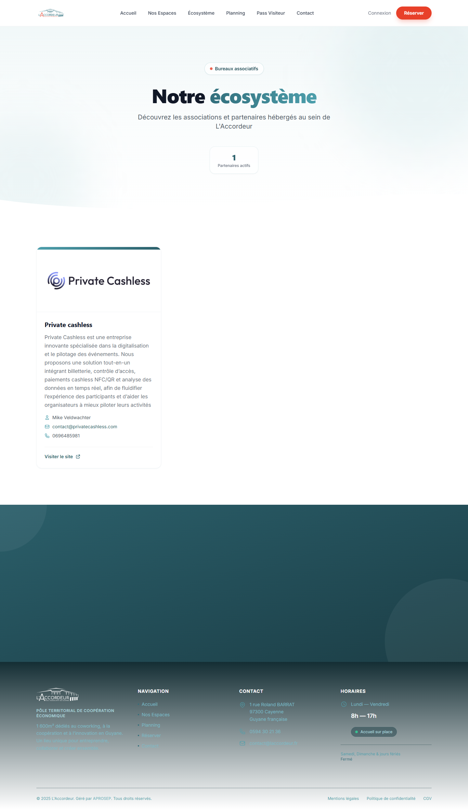

### 12.2 Gerer les partenaires

Depuis l'administration, la page **Partenaires** (`/admin/ecosystem`) permet de :

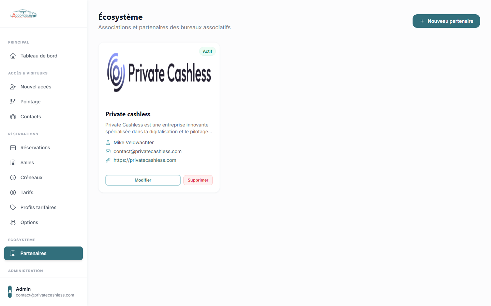

#### Ajouter un partenaire

1. Cliquez sur **Nouveau partenaire**
2. Remplissez :
   - **Nom** de l'association
   - **Presentation** (description de l'activite)
   - **Logo** (image, max 2 Mo)
   - **Nom du contact**, email, telephone
   - **Site web** (URL complete)
   - **Ordre d'affichage** et **Visible sur le site**
3. Cliquez sur **Ajouter le partenaire**

#### Modifier ou supprimer

- Cliquez sur **Modifier** pour editer les informations
- Cliquez sur **Supprimer** pour retirer le partenaire du site

---

## 13. Gestion des utilisateurs

> **Cette section est reservee aux administrateurs.**

### 13.1 Liste des utilisateurs

La page **Utilisateurs** (`/admin/users`) affiche tous les comptes avec leur nom, email et role.

### 13.2 Creer un utilisateur

1. Cliquez sur **Nouvel utilisateur**
2. Remplissez : nom, email, mot de passe
3. Selectionnez le **role** :
   - **Admin** : acces complet
   - **Manager** : gestion quotidienne
   - **Accueil** : pointage et consultation
4. Cliquez sur **Creer**

### 13.3 Modifier ou supprimer

- Cliquez sur **Modifier** pour changer le role ou reinitialiser le mot de passe
- Cliquez sur **Supprimer** pour desactiver le compte

---

## Support

Pour toute question ou probleme technique, contactez :

- **Email** : contact@privatecashless.com
- **Site** : https://laccordeur973.fr

---

*Document genere le 10 septembre 2026 - Version 1.0*
